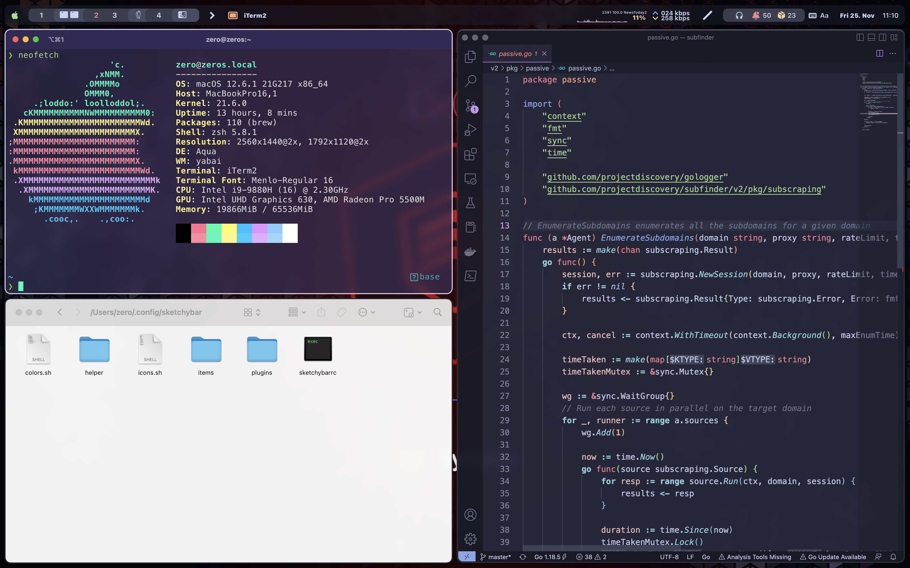

# dotfiles

This repository contains my personal SketchyBar, Yabai and Skhd configurations.



## 0x01 Installation

```bash
# --- install yabai, skhd, jq and all
brew tap homebrew/cask-fonts
brew install koekeishiya/formulae/yabai
brew install jq
brew install koekeishiya/formulae/skhd
brew install gh #(gh auth login for notifications)
brew install --cask sf-symbols
brew install --cask font-hack-nerd-font

# Installing Fonts
git clone git@github.com:shaunsingh/SFMono-Nerd-Font-Ligaturized.git /tmp/SFMono_Nerd_Font
mv /tmp/SFMono_Nerd_Font/* $HOME/Library/Fonts
rm -rf /tmp/SFMono_Nerd_Font/
curl -L https://github.com/kvndrsslr/sketchybar-app-font/releases/download/v1.0.3/sketchybar-app-font.ttf -o $HOME/Library/Fonts/sketchybar-app-font.ttf

# macOS Settings
echo "Changing macOS defaults..."
defaults write com.apple.NetworkBrowser BrowseAllInterfaces 1
defaults write com.apple.desktopservices DSDontWriteNetworkStores -bool true
defaults write com.apple.spaces spans-displays -bool false
defaults write com.apple.dock autohide -bool true
defaults write com.apple.dock "mru-spaces" -bool "false"
defaults write NSGlobalDomain NSAutomaticWindowAnimationsEnabled -bool false
defaults write com.apple.LaunchServices LSQuarantine -bool false
defaults write NSGlobalDomain com.apple.swipescrolldirection -bool false
defaults write NSGlobalDomain KeyRepeat -int 1
defaults write NSGlobalDomain NSAutomaticSpellingCorrectionEnabled -bool false
defaults write NSGlobalDomain AppleShowAllExtensions -bool true
defaults write NSGlobalDomain _HIHideMenuBar -bool true
defaults write NSGlobalDomain AppleHighlightColor -string "0.65098 0.85490 0.58431"
defaults write NSGlobalDomain AppleAccentColor -int 1
defaults write com.apple.screencapture location -string "$HOME/Desktop"
defaults write com.apple.screencapture disable-shadow -bool true
defaults write com.apple.screencapture type -string "png"
defaults write com.apple.finder DisableAllAnimations -bool true
defaults write com.apple.finder ShowExternalHardDrivesOnDesktop -bool false
defaults write com.apple.finder ShowHardDrivesOnDesktop -bool false
defaults write com.apple.finder ShowMountedServersOnDesktop -bool false
defaults write com.apple.finder ShowRemovableMediaOnDesktop -bool false
defaults write com.apple.Finder AppleShowAllFiles -bool true
defaults write com.apple.finder FXDefaultSearchScope -string "SCcf"
defaults write com.apple.finder FXEnableExtensionChangeWarning -bool false
defaults write com.apple.finder _FXShowPosixPathInTitle -bool true
defaults write com.apple.finder FXPreferredViewStyle -string "Nlsv"
defaults write com.apple.finder ShowStatusBar -bool false
defaults write com.apple.TimeMachine DoNotOfferNewDisksForBackup -bool YES
defaults write com.apple.Safari AutoOpenSafeDownloads -bool false
defaults write com.apple.Safari IncludeDevelopMenu -bool true
defaults write com.apple.Safari WebKitDeveloperExtrasEnabledPreferenceKey -bool true
defaults write com.apple.Safari com.apple.Safari.ContentPageGroupIdentifier.WebKit2DeveloperExtrasEnabled -bool true
defaults write NSGlobalDomain WebKitDeveloperExtras -bool true
defaults write com.apple.mail AddressesIncludeNameOnPasteboard -bool false

# --- Remove previous links
rm -f "${HOME}"/.{yabai,skhd}rc

# --- Install configs
git clone https://github.com/zer0yu/dotfiles.git "${HOME}"/.config/dotfiles
ln -s "${HOME}/.config/dotfiles/yabai/yabairc" "${HOME}/.yabairc"
ln -s "${HOME}/.config/dotfiles/skhd/skhdrc" "${HOME}/.skhdrc"
ln -s "${HOME}/.config/dotfiles/sketchybar" "${HOME}/.config/sketchybar"
# 需要手动修改 .yabairc 和 .skhdrc 文件中的 .sh 脚本路径

# Start Services
brew services start skhd
brew services start fyabai
brew services start sketchybar
```


(optional) add to `.zshrc`

```shell
# Sketchybar interactivity overloads
function brew() {
  command brew "$@" 

  if [[ $* =~ "upgrade" ]] || [[ $* =~ "update" ]] || [[ $* =~ "outdated" ]]; then
    sketchybar --trigger brew_update
  fi
}

# Fancy sketchybar commands
function margin () {
  if [ $1 = "on" ]; then
    yabai -m config top_padding 20
    sketchybar --animate sin 30 --bar margin=10 y_offset=10 corner_radius=9
  else
    yabai -m config top_padding 10
    sketchybar --animate sin 30 --bar margin=0 y_offset=0 corner_radius=0
  fi
}

function zen () {
  ~/.config/sketchybar/plugins/zen.sh $1
}

function suyabai () {
  SHA256=$(shasum -a 256 /opt/homebrew/bin/yabai | awk "{print \$1;}")
  sudo sed -i '' -e 's/sha256:[[:alnum:]]*/sha256:'${SHA256}'/' /private/etc/sudoers.d/yabai
}
```


## 0x02 Keyboard Shortcuts
### Reload / restart the yabai launch agent

<kbd>ctrl</kbd> + <kbd>alt</kbd> + <kbd>cmd</kbd> + <kbd>r</kbd>

### Show / hide items on desktop

<kbd>cmd</kbd> + <kbd>f3</kbd>

### Toggle full screen / up-full screen

<kbd>alt</kbd> + <kbd>cmd</kbd> + <kbd>space</kbd>

### Move Windows

|    Action   |                            Key Combination                            |
|-------------|-----------------------------------------------------------------------|
| Move left   | <kbd>ctrl</kbd> + <kbd>alt</kbd> + <kbd>cmd</kbd> + <kbd>left</kbd>   |
| Move right  | <kbd>ctrl</kbd> + <kbd>alt</kbd> + <kbd>cmd</kbd> + <kbd>right</kbd>  |
| Move up     | <kbd>ctrl</kbd> + <kbd>alt</kbd> + <kbd>cmd</kbd> + <kbd>up</kbd>     |
| Move down   | <kbd>ctrl</kbd> + <kbd>alt</kbd> + <kbd>cmd</kbd> + <kbd>down</kbd>   |


### Focus Windows

|    Action   |                   Key Combination                   |
|-------------|-----------------------------------------------------|
| Focus left  | <kbd>alt</kbd> + <kbd>cmd</kbd> + <kbd>left</kbd>   |
| Focus right | <kbd>alt</kbd> + <kbd>cmd</kbd> + <kbd>right</kbd>  |
| Focus up    | <kbd>alt</kbd> + <kbd>cmd</kbd> + <kbd>up</kbd>     |
| Focus down  | <kbd>alt</kbd> + <kbd>cmd</kbd> + <kbd>down</kbd>   |


### Resize Windows

|    Action    |                            Key Combination                              |
|--------------|-------------------------------------------------------------------------|
| Resize left  | <kbd>ctrl</kbd> + <kbd>alt</kbd> + <kbd>cmd</kbd> + <kbd>home</kbd>     |
| Resize right | <kbd>ctrl</kbd> + <kbd>alt</kbd> + <kbd>cmd</kbd> + <kbd>end</kbd>      |
| Resize up    | <kbd>ctrl</kbd> + <kbd>alt</kbd> + <kbd>cmd</kbd> + <kbd>pageUp</kbd>   |
| Resize down  | <kbd>ctrl</kbd> + <kbd>alt</kbd> + <kbd>cmd</kbd> + <kbd>pageDown</kbd> |


### Stack Windows

|    Action    |                            Key Combination                            |
|--------------|-----------------------------------------------------------------------|
| Stack left   | <kbd>shift</kbd> + <kbd>alt</kbd> + <kbd>cmd</kbd> + <kbd>left</kbd>  |
| Stack right  | <kbd>shift</kbd> + <kbd>alt</kbd> + <kbd>cmd</kbd> + <kbd>right</kbd> |


### Focus Windows (stack mode)

|    Action   |                            Key Combination                           |
|-------------|----------------------------------------------------------------------|
| Focus up    | <kbd>shift</kbd> + <kbd>alt</kbd> + <kbd>cmd</kbd> + <kbd>up</kbd>   |
| Focus down  | <kbd>shift</kbd> + <kbd>alt</kbd> + <kbd>cmd</kbd> + <kbd>down</kbd> |


### Toggle float / Un-float mode window

<kbd>ctrl</kbd> + <kbd>alt</kbd> + <kbd>cmd</kbd> + <kbd>space</kbd>


### Move Windows (floating mode)

|            Action             |                     Key Combination                   |
|-------------------------------|-------------------------------------------------------|
| Move left                     | <kbd>alt</kbd> + <kbd>cmd</kbd> + <kbd>left</kbd>     |
| Move right                    | <kbd>alt</kbd> + <kbd>cmd</kbd> + <kbd>right</kbd>    |
| full screen                   | <kbd>alt</kbd> + <kbd>cmd</kbd> + <kbd>up</kbd>       |
| place window to screen center | <kbd>alt</kbd> + <kbd>cmd</kbd> + <kbd>down</kbd>     |
| Move up left                  | <kbd>alt</kbd> + <kbd>cmd</kbd> + <kbd>home</kbd>     |
| Move down right               | <kbd>alt</kbd> + <kbd>cmd</kbd> + <kbd>end</kbd>      |
| Move up right                 | <kbd>alt</kbd> + <kbd>cmd</kbd> + <kbd>pageUp</kbd>   |
| Move down left                | <kbd>alt</kbd> + <kbd>cmd</kbd> + <kbd>pageDown</kbd> |


### Send Window to Spaces

|       Action        |                      Key Combination                    |
|---------------------|---------------------------------------------------------|
| Send to prev space  | <kbd>ctrl</kbd> + <kbd>cmd</kbd> + <kbd>left</kbd>      |
| Send to next space  | <kbd>ctrl</kbd> + <kbd>cmd</kbd> + <kbd>right</kbd>     |
| Send to space (1-9) | <kbd>ctrl</kbd> + <kbd>cmd</kbd> + <kbd>1 - 9</kbd>     |


### Send Window to Monitors (Displays)

|         Action       |                      Key Combination                    |
|----------------------|---------------------------------------------------------|
| Send to prev monitor | <kbd>ctrl</kbd> + <kbd>alt</kbd> + <kbd>left</kbd>      |
| Send to next monitor | <kbd>ctrl</kbd> + <kbd>alt</kbd> + <kbd>right</kbd>     |


### Focus Monitors (Displays)

|         Action       |                Key Combination                  |
|----------------------|-------------------------------------------------|
| Focus monitor 1      | <kbd>ctrl</kbd> + <kbd>alt</kbd> + <kbd>1</kbd> |
| Focus monitor 2      | <kbd>ctrl</kbd> + <kbd>alt</kbd> + <kbd>2</kbd> |
| Focus monitor 3      | <kbd>ctrl</kbd> + <kbd>alt</kbd> + <kbd>3</kbd> |


### Misc

|         Action              |                            Key Combination                         |
|-----------------------------|--------------------------------------------------------------------|
| Window rotate clockwise     | <kbd>alt</kbd> + <kbd>cmd</kbd> + <kbd>r</kbd>                     |
| Window rotate anticlockwise | <kbd>shift</kbd> + <kbd>alt</kbd> + <kbd>cmd</kbd> + <kbd>r</kbd>  |
| Window Equalize size        | <kbd>alt</kbd> + <kbd>cmd</kbd> + <kbd>\|</kbd>                    |
| Enable / Disable gaps       | <kbd>alt</kbd> + <kbd>cmd</kbd> + <kbd>g</kbd>                     |


## 0x03 Reference

https://github.com/FelixKratz/dotfiles

https://github.com/z20240/yabai

